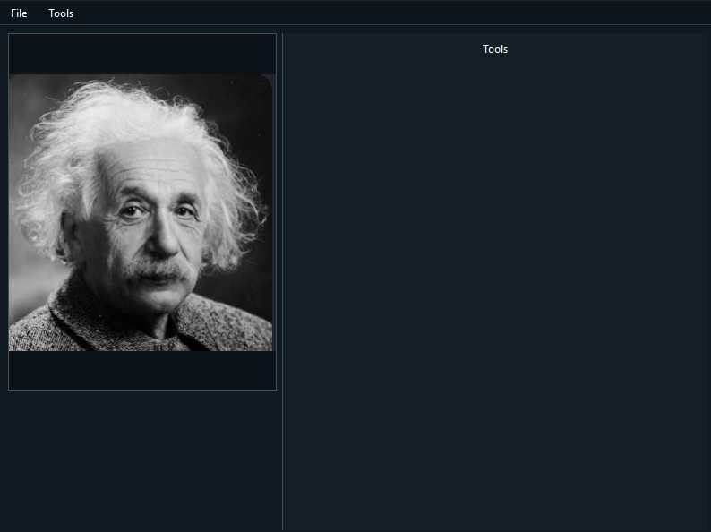
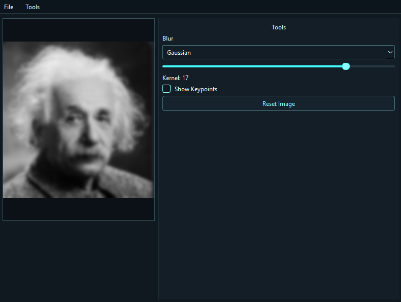
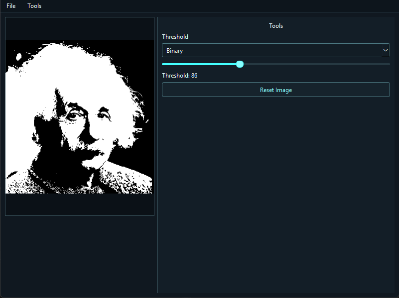
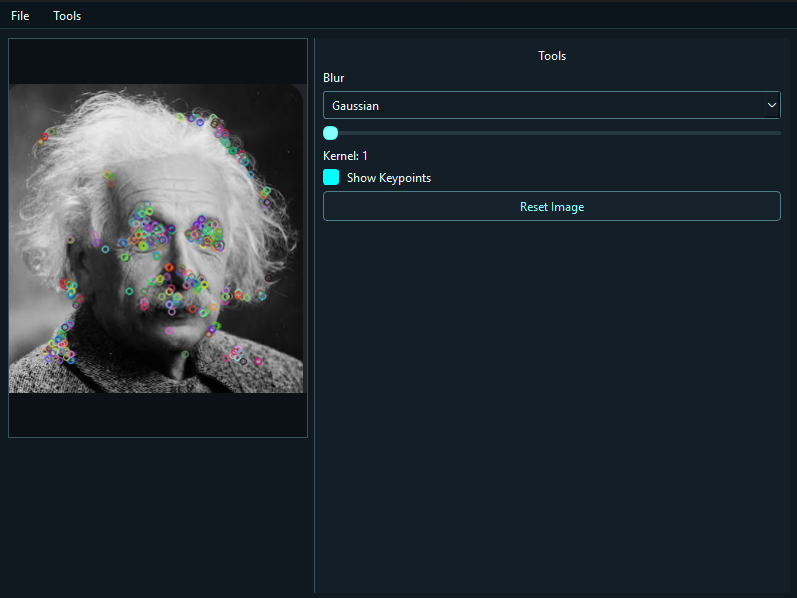
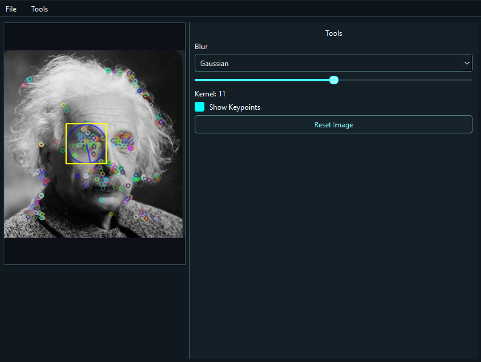

# CV Workbench

An interactive C++ desktop workbench for experimenting with OpenCV image processing and computer vision algorithms.

## Overview

CV Workbench provides a Qt desktop interface for loading an image, applying supported image operations, and inspecting results without changing the processing parameters in code. Its current tools cover Gaussian, Median, and Box blur; thresholding; and ORB keypoint selection with region-based blur.

## Features

- Load PNG, JPEG, and BMP images through the File menu.
- Apply Gaussian, Median, or Box blur to an image, with an adjustable odd-sized kernel.
- Enable ORB keypoint detection and display detected keypoints over the current image.
- Click inside the displayed image to select the nearest detected keypoint. The selected keypoint is highlighted and its size-derived region is outlined.
- Apply blur to the selected keypoint region. Each new region is blurred from the source image and merged into the current processed result, preserving previously processed regions and leaving the source image unchanged.
- Apply Binary, Binary Inverse, Trunc, To Zero, or To Zero Inverse thresholding with an adjustable threshold value.
- Reset the image from the Blur or Threshold controls. Loading a new image also clears the current processed image and keypoint selection.
- Adjust blur and threshold parameters interactively through sliders and type selectors.
- Use the bundled dark UI theme with restrained cyan accents.

## Screenshots

The screenshots directory contains a guide for the captures to add. The image references below are placeholders; no screenshots are included yet.


*Main CV Workbench interface with an image loaded.*


*Blur controls and a blurred image result.*


*Threshold controls and a thresholded image result.*


*ORB keypoints shown over the image.*


*A selected keypoint region and the result of region-based processing.*

## Architecture

The Qt application coordinates the interface and user interaction. The `CV_Core` static library contains the image loader and image-operation API, which uses OpenCV. The UI also uses OpenCV types and drawing for the selected-keypoint overlay, so the App/Core boundary is not a complete isolation of all OpenCV use from the UI.

```text
CV_Workbench application
        |
        +-- Application / MainWindow (Qt UI and interaction)
        |       |                         |
        |       +-- CV_Core --------------+-- OpenCV
        |
        +-- Qt resource collection (QSS theme)
```

## Technologies

- C++23
- Qt 6 Widgets
- OpenCV 4.11 (the version found by the current local configuration)
- CMake 3.20 or newer
- Visual Studio 2022 / MSVC toolchain configuration
- Git and GitHub (the repository has a GitHub remote)

## Project Structure

```text
.
├── CMakeLists.txt
├── README.md
├── resources/
│   ├── resources.qrc
│   └── styles/
│       └── cv_workbench.qss
├── screenshots/
│   └── README.md
└── src/
    ├── app/
    │   ├── Application.cpp / Application.h
    │   ├── MainWindow.cpp / MainWindow.h
    │   ├── config.h
    │   ├── main.cpp
    │   └── CMakeLists.txt
    └── core/
        ├── ImageLoader.cpp / ImageLoader.h
        ├── ImageOperations.cpp / ImageOperations.h
        └── CMakeLists.txt
```

- `src/app/` contains application startup, the Qt main window, its controls, and UI configuration.
- `src/core/` contains `ImageLoader` and the `Image` operations for blur, thresholding, and keypoints.
- `resources/` contains the Qt resource collection and QSS theme loaded by the application.
- `screenshots/` is reserved for future application captures.

## Getting Started

### Requirements

- CMake 3.20 or newer
- A C++23-capable compiler
- Qt 6 with the Widgets module
- OpenCV

The root `CMakeLists.txt` currently sets local dependency paths directly: `D:/Qt/6.11.2/msvc2022_64` for Qt and `D:/opencv/build` for OpenCV. On another machine, those paths must be updated to match the installed dependencies before configuring.

### Configure and build

From a Visual Studio 2022 x64 developer environment, run:

```powershell
cmake -S . -B build
cmake --build build --config Debug
```

The application target is `CV_Workbench`. CMake enables automatic MOC, UIC, and RCC processing; the QSS file is compiled into the application through `resources/resources.qrc`.

## Usage

1. Launch `CV_Workbench`.
2. Choose **File → Open** and load an image.
3. Choose **Tools → Blur** or **Tools → Threshold**.
4. Adjust the selected tool’s type and parameter controls to update the displayed result.
5. For keypoint interaction, enable **Show Keypoints** in the Blur controls, then click inside the displayed image to select the nearest detected keypoint. Its associated region is outlined; adjust the blur slider to process that region.
6. Use **Reset Image** in the active tool controls to clear the current processed result.

## Design / Implementation Notes

- Qt signals and slots handle menu actions, tool controls, and parameter changes. An event filter on the image label handles mouse selection.
- Images are held and processed as OpenCV `cv::Mat` values. The image loader converts decoded BGR data to RGB for the display path.
- `MainWindow` records the scaled image’s display rectangle and uses it to map between display and source-image coordinates for region selection and visualization.
- Processing results are kept separately from the source image. Region blur starts from the source for each newly selected region and merges that region into the existing processed result.
- The QSS stylesheet is included in the Qt resource collection and loaded by the application layer at startup.

## Future Improvements

- Make Qt and OpenCV dependency paths configurable instead of hard-coded in the root CMake file.
- Add automated tests for image operations and coordinate mapping.
- Capture and add the screenshots listed above.

## License

A license has not yet been added to this repository.
